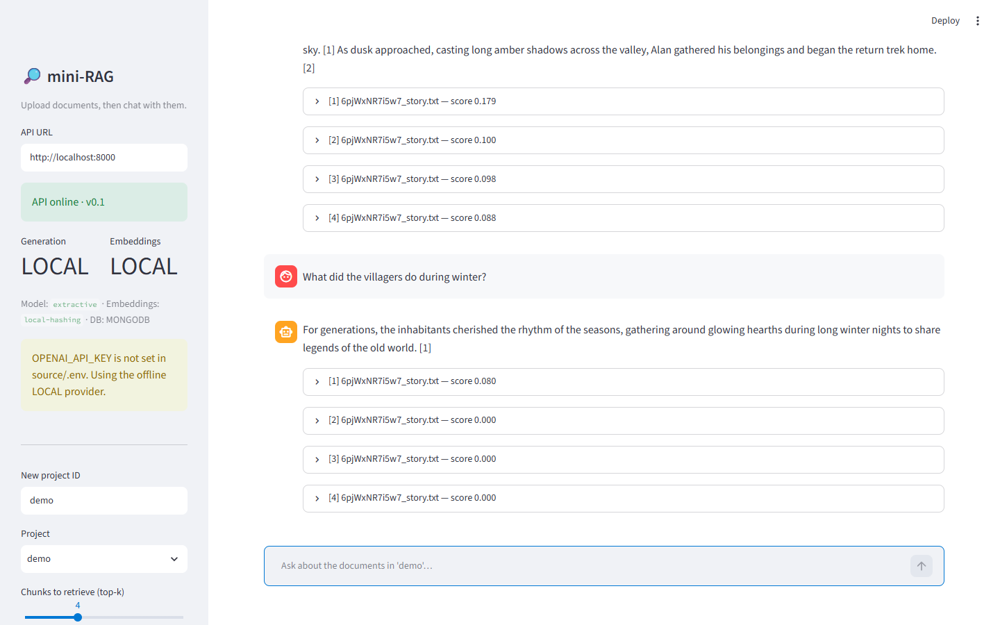
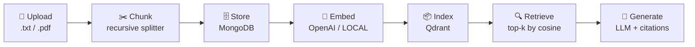
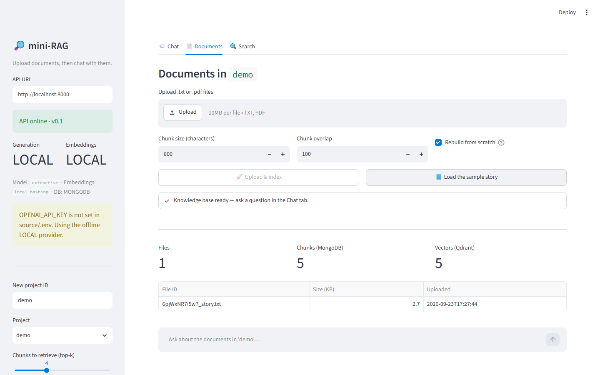
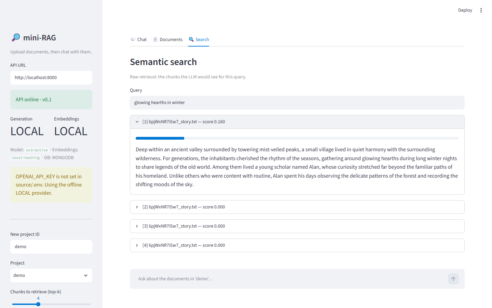
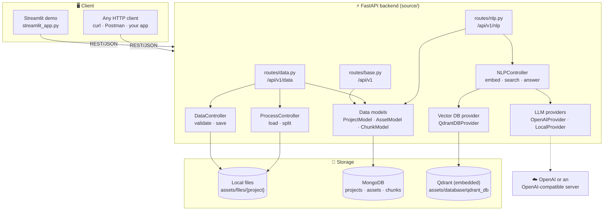
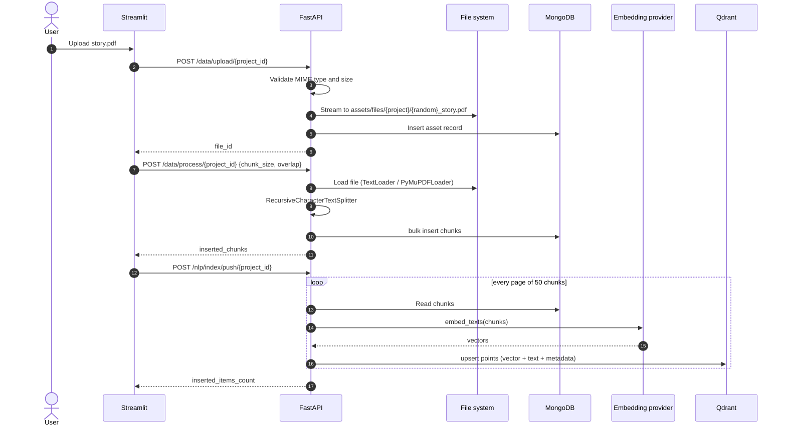
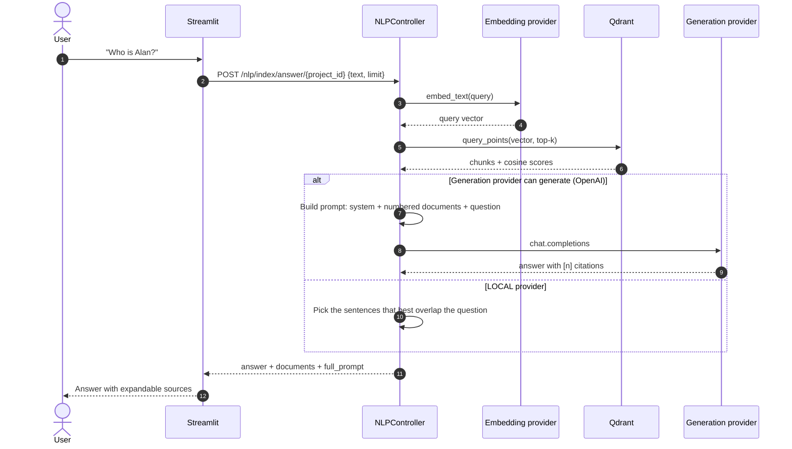
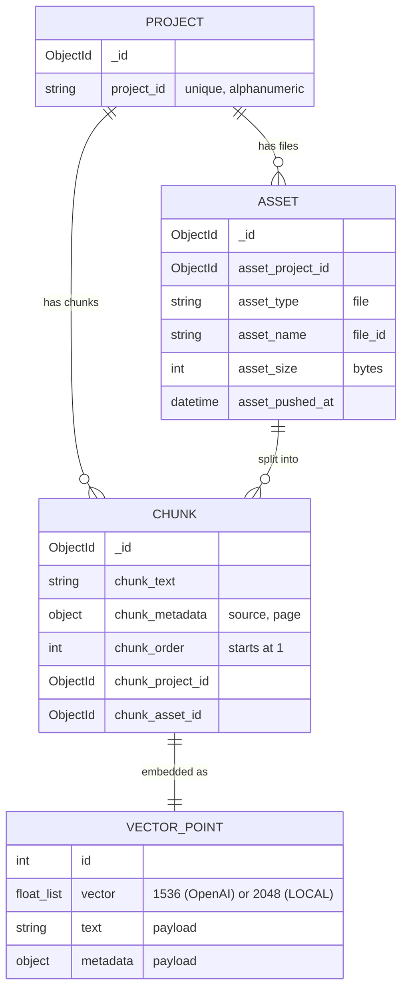
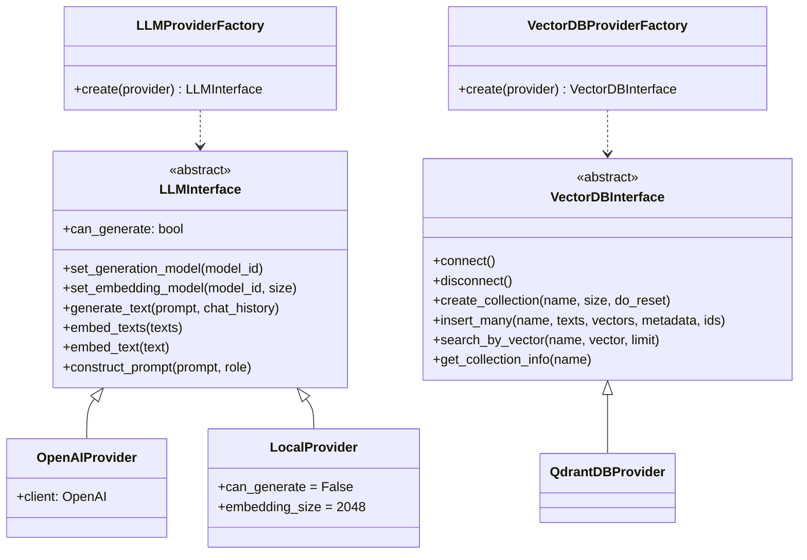
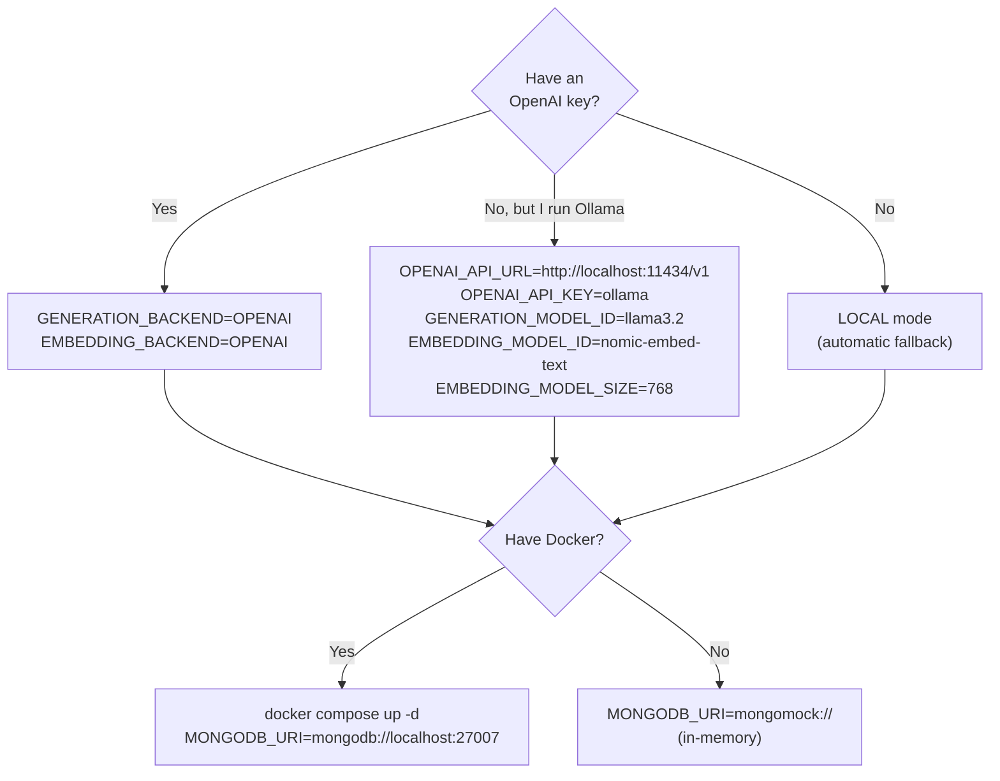

<div align="center">

# 🔎 mini-RAG

**A minimal, production-shaped Retrieval-Augmented Generation (RAG) service.**
Upload your documents, index them, and ask questions answered with citations.


[Overview](#overview) •
[Quickstart](#quickstart) •
[Architecture](#architecture) •
[API reference](#api-reference) •
[Configuration](#configuration) •
[Testing](#testing) •
[Troubleshooting](#troubleshooting)



</div>

---

## Table of contents

- [Overview](#overview)
- [Features](#features)
- [Quickstart](#quickstart)
  - [Prerequisites](#prerequisites)
  - [1. Clone and install](#1-clone-and-install)
  - [2. Configure](#2-configure)
  - [3. Start MongoDB](#3-start-mongodb)
  - [4. Run the API](#4-run-the-api)
  - [5. Run the Streamlit demo](#5-run-the-streamlit-demo)
- [Using the demo](#using-the-demo)
- [Architecture](#architecture)
  - [System overview](#system-overview)
  - [Ingestion pipeline](#ingestion-pipeline)
  - [Question answering pipeline](#question-answering-pipeline)
  - [Data model](#data-model)
  - [Provider abstraction](#provider-abstraction)
- [Project structure](#project-structure)
- [API reference](#api-reference)
- [Configuration](#configuration)
- [Run modes](#run-modes)
- [Testing](#testing)
- [Troubleshooting](#troubleshooting)
- [Roadmap](#roadmap)
- [Contributing](#contributing)
- [License](#license)

---

## Overview

**mini-RAG** is a small but complete RAG system built step by step. It shows the full path from a raw file to a grounded answer:



It has two parts:

| Component | Tech | Purpose |
|---|---|---|
| **Backend API** | FastAPI · Motor · Qdrant · OpenAI SDK | Upload, chunk, embed, index, search and answer |
| **Demo UI** | Streamlit | A chat interface over the API, with document management and raw search |

> [!TIP]
> **No API key? No problem.** If `OPENAI_API_KEY` isn't set, mini-RAG switches to a built-in **LOCAL** provider (hashing embeddings plus extractive answers), so the whole demo runs offline. Set the key to get real semantic search and LLM-written answers.

## Features

- 📄 **Multi-format ingestion**: plain text and PDF (via PyMuPDF), with validated type and size limits.
- ✂️ **Configurable chunking**: chunk size and overlap for each request, using LangChain's `RecursiveCharacterTextSplitter`.
- 🗂️ **Projects**: every project has its own files, chunks and vector collection.
- 🧮 **Pluggable LLM providers**: OpenAI or any OpenAI-compatible server (Ollama, vLLM, LM Studio…), plus an offline `LOCAL` fallback.
- 📦 **Embedded vector DB**: Qdrant runs in-process on disk, with no server to manage.
- 🔍 **Semantic search and RAG answers** with numbered citations and similarity scores.
- 💬 **Streamlit demo**: chat, upload-and-index in one click, a sample dataset, and source inspection.
- 🧪 **Tested end to end**: the pytest suite runs the full pipeline offline (in-memory MongoDB plus the LOCAL provider).

---

## Quickstart

### Prerequisites

| Requirement | Version | Notes |
|---|---|---|
| Python | 3.10+ | Tested on 3.14 |
| Docker Desktop | any recent | Only needed for MongoDB. See [run modes](#run-modes) to skip it |
| OpenAI API key | optional | Without one, the app runs in offline LOCAL mode |

### 1. Clone and install

```bash
git clone https://github.com/fahadalbradi/mini-RAG.git
cd mini-RAG
```

<details open>
<summary><b>Option A: MiniConda (recommended)</b></summary>

```bash
conda create -n mini-rag python=3.11 -y
conda activate mini-rag
pip install -r source/requirements.txt
```

</details>

<details>
<summary><b>Option B: venv</b></summary>

```bash
python -m venv .venv
# Windows
.venv\Scripts\activate
# macOS / Linux
source .venv/bin/activate

pip install -r source/requirements.txt
```

</details>

### 2. Configure

```bash
cd source
cp .env.example .env        # Windows PowerShell: Copy-Item .env.example .env
```

Open `source/.env` and set your key (or leave it empty for offline mode):

```ini
OPENAI_API_KEY="sk-..."
```

### 3. Start MongoDB

```bash
cd ../docker
docker compose up -d        # MongoDB on localhost:27007
cd ../source
```

> [!NOTE]
> Don't want Docker? Set `MONGODB_URI="mongomock://"` in `.env` to use an in-memory database. Its data is lost when the API restarts.

### 4. Run the API

From the `source/` folder:

```bash
uvicorn main:app --reload --port 8000
```

Interactive API docs: **http://localhost:8000/docs**

### 5. Run the Streamlit demo

In a second terminal, also from `source/`:

```bash
streamlit run streamlit_app.py
```

Open **http://localhost:8501**. 🎉

> [!TIP]
> **One-command demo:** from the repository root, `streamlit run streamlit_app.py` starts the API for you when it isn't already running (logs go to `api.log`), then opens the UI.
> To run the API yourself from the root instead: `uvicorn main:app --app-dir source --reload --port 8000`.

> [!TIP]
> If the API runs somewhere else, set `MINIRAG_API_URL` before starting Streamlit, or change the **API URL** field in the sidebar.

---

## Using the demo

| Step | Screen |
|---|---|
| **1. Add documents.** Open **📄 Documents**, pick a project, and either upload `.txt`/`.pdf` files or click **Load the sample story**. The app uploads, chunks and indexes them, then shows the file, chunk and vector counts. |  |
| **2. Chat.** Ask questions in **💬 Chat**. Every answer lists the retrieved chunks with their similarity score, so you can check where it came from. |  |
| **3. Inspect retrieval.** **🔍 Search** shows the raw top-k chunks for a query, exactly what the LLM would see. Use it to tune chunk size and top-k. |  |

**Sidebar controls:** the API health check, the active providers and models, project selection or creation, top-k, and a toggle that shows the full prompt sent to the LLM.

---

## Architecture

### System overview



The backend is split into layers:

| Layer | Folder | Responsibility |
|---|---|---|
| **Routes** | `routes/` | HTTP endpoints and request/response schemas |
| **Controllers** | `controllers/` | Business logic: file validation, parsing, chunking, RAG orchestration |
| **Models** | `models/` | MongoDB access (repository pattern), Pydantic schemas, enums |
| **Stores** | `stores/` | Swappable integrations: LLM providers and vector databases, each behind an interface and created by a factory |
| **Helpers** | `helpers/` | Typed settings loaded from `.env` |

### Ingestion pipeline



### Question answering pipeline



**The prompt** (`stores/llm/templates/rag.py`) has three parts:

```text
[system]  Answer ONLY from the provided documents, cite them as [1], [2]…,
          and say so if the answer isn't there.
[user]    ## Document [1]
          <chunk text>
          ## Document [2]
          <chunk text>
          …
          Based only on the documents above, answer the question.
          ## Question: <query>
          ## Answer:
```

### Data model



MongoDB is the **source of truth** for chunks. The Qdrant collection `collection_{project_id}` is a **derived index**: you can rebuild it at any time with `POST /nlp/index/push/{project_id}` and `{"do_reset": 1}`, for example after changing the embedding model.

### Provider abstraction

Integrations sit behind interfaces, so adding a provider means writing one class and registering it in the factory:



---

## Project structure

```text
mini-RAG/
├── assets/images/              # README screenshots
├── docker/
│   └── docker-compose.yml      # MongoDB (localhost:27007)
├── samples/
│   └── story.txt               # Demo document used by "Load the sample story"
└── source/
    ├── main.py                 # FastAPI app and lifespan (DB, LLM and vector DB clients)
    ├── streamlit_app.py        # Streamlit demo UI
    ├── requirements.txt
    ├── .env.example            # Copy to .env
    ├── .streamlit/config.toml  # UI theme and upload limit
    ├── helpers/
    │   └── config.py           # Pydantic settings
    ├── routes/
    │   ├── base.py             # /api/v1 health, /api/v1/projects
    │   ├── data.py             # upload · assets · process
    │   ├── nlp.py              # index push/info · search · answer
    │   └── schemes/            # Request bodies
    ├── controllers/
    │   ├── BaseController.py   # Paths and helpers
    │   ├── DataController.py   # Upload validation and safe file names
    │   ├── ProjectController.py
    │   ├── ProcessController.py# Load (txt/pdf) and split
    │   └── NLPController.py    # Index, search, RAG answer
    ├── models/
    │   ├── ProjectModel.py · AssetModel.py · ChunkModel.py
    │   ├── db_schemes/         # Pydantic documents
    │   └── enums/              # Response signals, collection names
    ├── stores/
    │   ├── llm/                # LLMInterface, providers, factory, prompt templates
    │   └── vectordb/           # VectorDBInterface, Qdrant provider, factory
    ├── assets/                 # (runtime, git-ignored) files/ and database/
    └── tests/                  # pytest: offline end-to-end and unit tests
```

---

## API reference

Base URL: `http://localhost:8000`. The full OpenAPI docs are at `/docs` (Swagger) and `/redoc`.

| Method | Endpoint | Body | Description |
|---|---|---|---|
| `GET` | `/api/v1/` | – | Health, version, active providers and startup warnings |
| `GET` | `/api/v1/projects` | – | List project IDs |
| `POST` | `/api/v1/data/upload/{project_id}` | `multipart: file` | Upload a `.txt`/`.pdf` file. Returns `file_id` |
| `GET` | `/api/v1/data/assets/{project_id}` | – | List a project's files and its chunk count |
| `POST` | `/api/v1/data/process/{project_id}` | `{file_id?, chunk_size, overlap, do_reset}` | Split one file, or every file if `file_id` is omitted, into chunks |
| `POST` | `/api/v1/nlp/index/push/{project_id}` | `{do_reset}` | Embed all chunks into the vector DB |
| `GET` | `/api/v1/nlp/index/info/{project_id}` | – | Vector collection stats |
| `POST` | `/api/v1/nlp/index/search/{project_id}` | `{text, limit}` | Semantic search (top-k chunks) |
| `POST` | `/api/v1/nlp/index/answer/{project_id}` | `{text, limit}` | RAG answer with sources |

> [!IMPORTANT]
> `project_id` must be **alphanumeric** (`[A-Za-z0-9]+`). Other values get a `422`. The ID is also used as a folder name, so this check stops path traversal.

<details>
<summary><b>End-to-end example with curl</b></summary>

```bash
# run from the repository root
P=demo

# 1) Upload
curl -F "file=@samples/story.txt;type=text/plain" \
     http://localhost:8000/api/v1/data/upload/$P
# {"signal":"successfully validated the uploaded file","file_id":"okYr9zy2Jjv6_story.txt",...}

# 2) Chunk every file in the project
curl -H "Content-Type: application/json" \
     -d '{"chunk_size": 800, "overlap": 100, "do_reset": 1}' \
     http://localhost:8000/api/v1/data/process/$P
# {"signal":"file processing succeeded","inserted_chunks":5,"processed_files":1}

# 3) Embed and index
curl -H "Content-Type: application/json" -d '{"do_reset": 1}' \
     http://localhost:8000/api/v1/nlp/index/push/$P
# {"signal":"insert into vector db succeeded","inserted_items_count":5}

# 4) Ask
curl -H "Content-Type: application/json" \
     -d '{"text": "Who is Alan?", "limit": 4}' \
     http://localhost:8000/api/v1/nlp/index/answer/$P
```

</details>

<details>
<summary><b>Response signals</b></summary>

Every response has a `signal` field with a readable status (`models/enums/ResponseEnums.py`):

| Signal | HTTP |
|---|---|
| `successfully validated the uploaded file` | 200 |
| `file type is not supported` / `file size exceeds the maximum limit` | 400 |
| `file processing succeeded` / `file processing failed` | 200 / 400 |
| `no files found for this project` / `file id not found` | 400 |
| `insert into vector db succeeded` / `insert into vector db failed` | 200 / 400 |
| `vector db search succeeded` / `vector db search failed` | 200 / 400 |
| `rag answer succeeded` / `rag answer failed` | 200 / 400 |

</details>

---

## Configuration

All settings live in `source/.env` (template: [`source/.env.example`](source/.env.example)).

| Variable | Default | Description |
|---|---|---|
| `APP_NAME` / `APP_VERSION` | `mini-RAG` / `0.1` | Shown by the health endpoint |
| `FILE_ALLOWED_TYPES` | `["text/plain","application/pdf"]` | Accepted MIME types |
| `FILE_MAX_SIZE` | `10` | Max upload size in **MB** |
| `FILE_DEFAULT_CHUNK_SIZE` | `512000` | Read buffer for streaming uploads, in **bytes** |
| `MONGODB_URI` | `mongodb://localhost:27007` | MongoDB connection, or `mongomock://` for in-memory |
| `MONGODB_DATABASE` | `mini-rag` | Database name |
| `GENERATION_BACKEND` | `OPENAI` | `OPENAI` or `LOCAL` |
| `EMBEDDING_BACKEND` | `OPENAI` | `OPENAI` or `LOCAL` |
| `OPENAI_API_KEY` | – | Your key. If missing, the app falls back to `LOCAL` |
| `OPENAI_API_URL` | *(empty)* | Base URL for OpenAI-compatible servers |
| `GENERATION_MODEL_ID` | `gpt-4o-mini` | Chat model |
| `EMBEDDING_MODEL_ID` | `text-embedding-3-small` | Embedding model |
| `EMBEDDING_MODEL_SIZE` | `1536` | Embedding dimension. Must match the model |
| `INPUT_DEFAULT_MAX_CHARACTERS` | `4096` | Truncation limit for text sent to the embedder |
| `GENERATION_DEFAULT_MAX_TOKENS` | `512` | Max answer tokens |
| `GENERATION_DEFAULT_TEMPERATURE` | `0.1` | Sampling temperature |
| `VECTOR_DB_BACKEND` | `QDRANT` | Vector DB provider |
| `VECTOR_DB_PATH` | `qdrant_db` | Folder under `source/assets/database/` |
| `VECTOR_DB_DISTANCE_METHOD` | `COSINE` | `COSINE` or `DOT` |

> [!WARNING]
> If you change the embedding backend or model, **re-index** each project with `{"do_reset": 1}`. Vectors from different models aren't comparable.

---

## Run modes

Choose the setup that fits your machine:



| Mode | Retrieval quality | Answers | Needs |
|---|---|---|---|
| **OpenAI** | ⭐⭐⭐ semantic | LLM-written, cited | API key |
| **Ollama / vLLM / LM Studio** | ⭐⭐–⭐⭐⭐ semantic | LLM-written, cited | A local model server |
| **LOCAL** | ⭐ lexical (keyword overlap) | The best-matching sentences, cited | Nothing |

> [!NOTE]
> The LOCAL provider exists so you can test the pipeline and demo it anywhere. It matches **words**, not meaning, so "villagers" won't match "inhabitants". Use a real embedding model for real use.

---

## Testing

The test suite runs **fully offline**: it uses in-memory MongoDB (`mongomock`), the LOCAL provider and a temporary Qdrant folder. You don't need Docker or an API key.

```bash
cd source
pytest -q
```

```text
.......                                                    [100%]
7 passed
```

| Test | What it covers |
|---|---|
| `test_full_rag_pipeline` | upload → assets → process → index → info → search → answer |
| `test_rejects_unsupported_file_type` | MIME type validation |
| `test_rejects_invalid_project_id` | Alphanumeric project IDs (path safety) |
| `test_search_on_unindexed_project_fails_cleanly` | A clean 400 instead of a crash |
| `test_answer_uses_generation_client_with_numbered_documents` | Prompt assembly for the LLM path |
| `test_extractive_answer_cites_matching_sentence` | The offline answer path |

---

## Troubleshooting

<details>
<summary><b>The Streamlit sidebar says "Cannot reach the API"</b></summary>

Start the backend from `source/` with `uvicorn main:app --reload --port 8000`, and check that the **API URL** field in the sidebar matches.
</details>

<details>
<summary><b><code>ServerSelectionTimeoutError</code> / requests hang for 5 s and fail</b></summary>

MongoDB isn't running. Start it with `cd docker && docker compose up -d`, and check that `docker ps` lists `mongodb` on port `27007`. You can also set `MONGODB_URI="mongomock://"`.
</details>

<details>
<summary><b>Qdrant: "Storage folder … is already accessed by another instance"</b></summary>

Embedded Qdrant allows only one process per folder. Stop the other `uvicorn` process, or run it without multiple `--workers`.
</details>

<details>
<summary><b>The sidebar shows "OPENAI_API_KEY is not set … Using the offline LOCAL provider"</b></summary>

This is expected without a key. Add `OPENAI_API_KEY` to `source/.env`, restart the API, and re-index with **Rebuild from scratch** checked.
</details>

<details>
<summary><b>Wrong vector dimension after switching models</b></summary>

The collection was created with the old model's dimension. Re-index with `{"do_reset": 1}`, or use **Load / Upload & index** in the UI, which always rebuilds the index.
</details>

---

## Roadmap

- [x] File upload with validation
- [x] Text/PDF parsing and chunking
- [x] MongoDB persistence (projects, assets, chunks)
- [x] Pluggable LLM providers (OpenAI-compatible and offline LOCAL)
- [x] Qdrant vector index, semantic search and RAG answers
- [x] Streamlit demo and offline test suite
- [ ] Streaming answers (SSE)
- [ ] Conversation memory (multi-turn follow-ups)
- [ ] More loaders (DOCX, HTML, Markdown)
- [ ] Hybrid search (BM25 + vectors) and re-ranking
- [ ] PGVector provider
- [ ] Containerize the API and UI in `docker-compose`

## Contributing

1. Fork the repo and create a branch: `git checkout -b feature/my-change`
2. Make your change and keep `pytest` green
3. Open a pull request that describes what changed and why

To add a new LLM or vector DB, implement `LLMInterface` or `VectorDBInterface` in `stores/*/providers/` and register it in the matching factory.

## License

Released under the [Apache License 2.0](LICENSE).
